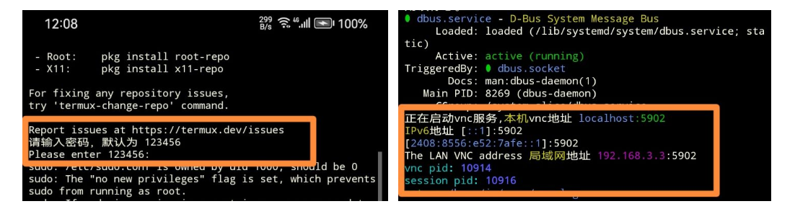

# 在手机上安装超时空猫猫

本项目提供了在安卓手机上安装 [chronocat](https://chronocat.vercel.app/) 的方法
使用 [ZeroTermux](https://github.com/hanxinhao000/ZeroTermux) + debian-sid + xfce4 + linuxqq 制作

- 基于 Linux QQ
- 运行内存大于 600M
- 恢复包大小 795 MB（压缩后）
- 支持持久化 QQ 登录状态和数据

# 目录：
- 1. 安装 ZeroTermux 和 VncView
- 2. 安装 chronocat
   * 2.1 方法1. 使用恢复包安装（推荐）
   * 2.2 方法2. 使用命令安装
- 3. 启动 VNC
- 4. 登录 VNC
- 5. 登录 Linux QQ
- 6. 启动 [Koishi](https://koishi.chat)
- 7. 修改 chronocat 配置

## 1. 安装 ZeroTermux 和 VncView
前往[hanxinhao000/ZeroTermux](https://github.com/hanxinhao000/ZeroTermux/releases)下载 ZeroTermux 安装包并安装
安装一个vnc客户端，推荐 [RealVNC](https://play.google.com/store/apps/details?id=com.realvnc.viewer.android)

- 注意事项： 
   直接从 GitHub 下载 ZeroTermux 速度可能会很慢，建议使用 [ghproxy.com](https://ghproxy.com) 代理
    
## 2. 安装 chronocat
   - 方法1. 使用恢复包（推荐）
      >优点：操作简单，易上手
缺点：无
   - 方法2. 使用命令安装
      >优点：可以学习到很多知识
缺点：耗时，需要良好的网络环境，再次启动比较麻烦，需要手动启动 VNC

### 2.1 使用恢复包安装（推荐）

#### 2.1.1 下载恢复包
前往 [百度网盘](https://pan.baidu.com/s/1G1_-qzpL3b1bDoqDcWDnlg?pwd=i4bt) 或 [Github releases](https://github.com/initialencounter/chronocat-termux/releases) 下载 ZeroTermux 恢复包, 并将恢复包放在 手机的 `内部存储/xinhao/data/` 目录
   

- 注意事项： 
    - 恢复包要放在 `内部存储/xinhao/data/`目录或者 `/sdcard/xinhao/data`目录，否则在恢复容器的时候无法找到恢复包

#### 2.1.2 恢复容器
- 打开ZeroTermux
- 恢复
    进入ZeroTermux 点击音量上键 呼出菜单栏 点击菜单栏的 `备份/恢复` 选择下载的恢复包
    
    输入一个容器名字点击恢复 这个过程需要等待几分钟
    
- 切换容器
   
    再次点击音量上键， 呼出菜单栏，点击菜单栏的 `容器切换` 选择刚才创建的容器 询问你是否需要重启时， 选择立即重启，接下你将进入启动界面

- 注意事项：
    - 如果音量上键无法呼出菜单，说明你的ZeroTermux版本比较旧，那么可以使用右滑左侧的屏幕边缘来呼出菜单栏

### 2.2. 使用命令安装（不推荐）
若你使用的是 `2.1 使用恢复包安装`，请跳过该步骤
#### 2.2.1 安装linux容器
   输入命令
   ```shell
   pkg upgrade;
   bash -c "$(curl -L https://gitee.com/initencunter/chronocat-termux/raw/main/install_debian.sh)"
   ```
#### 2.2.2 安装图形界面 
   ```shell
   # 进入容器
   bash debian-sid-arm64.sh
   # 安装 tmoe
   apt install -y curl ; bash -c "$(curl -L gitee.com/mo2/linux/raw/2/2)"
   # 一路回车，选择tools
   # 再选择安装 xfce 图形界面 以及 tigervnc
   ```
### 2.2.3 安装 linux QQ
   ```shell
   # 安装Linux QQ
   curl -o /root/linuxqq_3.1.2-13107_arm64.deb https://dldir1.qq.com/qqfile/qq/QQNT/ad5b5393/linuxqq_3.1.2-13107_arm64.deb
   dpkg -i /root/linuxqq_3.1.2-13107_arm64.deb && apt-get -f install -y && rm /root/linuxqq_3.1.2-13107_arm64.deb
   ```
### 2.2.4 安装 LiteLoader
   ```shell
   curl -L -o /tmp/LiteLoaderQQNT.zip https://github.com/LiteLoaderQQNT/LiteLoaderQQNT/releases/download/0.5.3/LiteLoaderQQNT.zip
   unzip /tmp/LiteLoaderQQNT.zip -d /opt/QQ/resources/app/
   rm /tmp/LiteLoaderQQNT.zip
   ```
### 2.2.5 安装 chronocat
   先不在这会儿安装，等登录 qq 后，打开 qq 设置里的 LiteLoader 插件市场来安装 Chronocat
### 2.2.6 创建一个新用户并登录
   ```shell
   # ie改成你的用户名
   adduser ie
   # 设置密码
   # 登录用户
   login ie
   ```
### 3. 启动 VNC
>如果你使用的是恢复包，VNC将会在进入终端时自启，只需要输入 VNC 密码即可
ZeroTermux的终端会显示 `[sudo] passord for ie`, 你需要输入默认的密码 `123456`输入好之后点击回车

如果你的 chronocat 是用命令安装的，那么你需要手动启动 VNC 在终端输入 startvnc，再输入你设置的密码

- 注意事项：输入密码时，终端是没有变化的，看起来像是没有输入成功，但其实已经输入了，输完回车即可

### 4. 登录vnc
使用VNC软件登陆服务器IP:5902 默认密码是123456


### 5. 登录qqnt

在终端中输入qq, 回车
一段时间后桌面会弹出二维码，拿出手机来扫码即可
- 注意事项： 
>登录后qqnt会提醒你更新，不要更新
登录成功后可以前往 127.0.0.1:5500 查看是否成功接入 chronocat
若出现以下画面, 恭喜你接入了 chronocat
[](https://chronocat.vercel.app/connect)

### 6. 启动koishi
在终端输入命令 `cd;yarn start`
### 7. 修改chronocat配置
修改目录/home/ie/.chronocat/config/chronocat.yml，修改后重启 termux